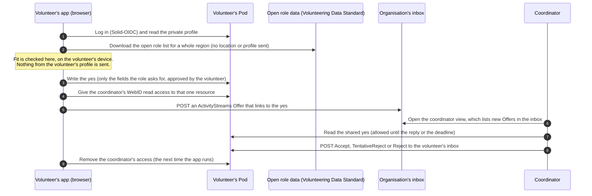

# Architecture sketch

This is a sketch for a proof of concept, not a specification. It uses only existing Solid building blocks and the ODI's Volunteering Data Standard. Anything marked "draft" is a proposal to settle in the architecture workshop.

## Actors

- **Volunteer.** Has a WebID and a Pod, and uses the Just the Yes web app in a browser.
- **Organisation.** Has an inbox for yeses (a Linked Data Notifications inbox) and a named coordinator who replies. The coordinator logs in with their own WebID, which the role names in its reply promise.
- **Role data.** Public data in the Volunteering Data Standard. The app reads roles from the public API or from an organisation's own Pod. In the pilot, only roles from pilot organisations (published with a coordinator's WebID and an inbox) offer a yes. Other roles link to the organisation's usual way to apply (`vol:applyLink`).

There is no Just the Yes server. The app runs in the volunteer's browser and talks only to the volunteer's Pod, the public role data and the organisation's inbox.

## The flow

## What each Solid building block does

| Need | Solid building block | Notes |
|---|---|---|
| Keep the volunteer's details with the volunteer | A private resource in their Pod | Owner-only access. See [examples/02-profile.ttl](examples/02-profile.ttl) |
| Log in | Solid-OIDC | Same login for volunteers and coordinators |
| Know what a role needs | Volunteering Data Standard (`vol:Role`, skills, requirements, accessibility) | Real data exists today. See [examples/01-role.ttl](examples/01-role.ttl) |
| Check fit without sending data | Client-side code in the browser | The app downloads a whole region's roles (a few thousand records) and filters them locally, so no location or profile goes to the API. Simple, explainable rules. No score leaves the device |
| Send the yes | Linked Data Notifications, ActivityStreams `as:Offer` | The notification holds links only. See [examples/04-offer-notification.ttl](examples/04-offer-notification.ttl) |
| Share only the yes, for a limited time | Access control on one resource, for the coordinator's WebID | WAC and ACP have no expiry, so the app removes the rule when the reply arrives or the deadline passes, the next time it runs. Inrupt ESS access grants carry an expiration date that the server enforces. See [examples/06-yes-access.acl](examples/06-yes-access.acl) |
| Reply | Linked Data Notifications, `as:Accept` / `as:TentativeReject` / `as:Reject` | A named person signs the reply, and `as:context` points back to the yes. See [examples/05-reply.ttl](examples/05-reply.ttl) |
| Tell the coordinator a yes arrived | A simple coordinator view that lists the inbox | An email alert (for example through the Solid Notifications Protocol) is a workshop question |
| Show the reply promise | Draft properties on the role (`jty:replyPromise`) | Could become optional properties in the standard |

## The rules, and how the proof of concept enforces them

1. **The organisation gets the yes, not the profile.** The app never sends the profile or any score. The first message may contain only the fields the role lists in `jty:firstMessageAsks` (a SHACL shape may be better; a workshop question), plus one short note. There is no "attach my whole profile" button, because if some people share more to stand out, everyone else soon feels they must. The coordinator view also ignores anything outside the role's fields, so another client can't get round the rule.
2. **Every yes gets a reply by a set date.** The role shows who replies and within how long. The app shows the volunteer the date. If the promise lapses, the app removes the coordinator's access and, if the optional allowance is on, the volunteer gets that yes back.
3. **No more yeses than a role can answer.** Each role publishes how many more yeses it can answer by its reply date. The coordinator view lowers that number as yeses arrive, and the volunteer's app hides the yes button at zero. A plain inbox can't refuse a late yes, so overshoot is measured, not prevented. This keeps the reply promise honest. In a small simulation of priority applications (see [docs/background/what-should-k-be.pdf](docs/background/what-should-k-be.pdf)), promises broke even with one priority message per person when roles hid how full they were; showing free capacity is what kept them.
4. **Optional: a few yeses a month per person.** The pilot also tests a small monthly allowance per volunteer (5 in the examples). The app enforces it, so it is a norm, not a security guarantee, and the pilot drops it if it puts people off. The right number is an open question.

## Threats and what the design does about them

| Threat | Response in the proof of concept | Later |
|---|---|---|
| Spam into an organisation's inbox | The inbox accepts posts only from logged-in agents (a server setting). The coordinator view accepts a yes only if it lives in the sending WebID's own Pod and the coordinator can read it. Ask the ODI about rate limits on its servers | Server-side limits per WebID |
| Getting round the monthly budget with extra WebIDs | Treated as a norm and measured, not claimed as a guarantee | Counters issued by Pod providers, or verified credentials |
| The organisation copies what it read before access ends | Cannot be prevented technically. The first message is small, and the reply promise states how long the organisation keeps it | Retention terms as machine-readable policy |
| Pressure to over-share | Fixed fields per role, plus one short note | Same |
| Identifying someone from a combination of details in a small place | Area instead of address. No date of birth in the first message | Same |
| Fake roles that harvest volunteers' details | Roles come from known publishers. The inbox and the coordinator's WebID must belong to the publishing organisation | Verified organisation credentials |
| An organisation that never replies | The app shows overdue promises and returns the yes to the volunteer's budget | An on-time record per organisation |

## Out of scope for the proof of concept

- Real sensitive data. The pilot uses real first names, contact details and availability, with consent, and test data for access needs, because ODI-hosted Pods are for development and piloting.
- Production hosting and scale.
- Verified credentials, for example references or background checks from an EU digital identity wallet. This is a possible next step.
- Any AI. Matching uses plain, explainable rules.

## Questions for the architecture workshop

1. Which single access model should the proof of concept use on ODI-hosted servers for time-limited sharing: WAC with removal by the app, ACP, or Inrupt's access grants (which build on ACP)?
2. Should the inbox be per organisation or per role? Who may post to it, and how are limits set?
3. Where should role data live: the public API only, or also in organisations' own Pods?
4. How should the person's side reuse the standard's taxonomies? The accessibility list has 16 broad categories. For example, `vol:PhysicalAccessibility` describes the physical ability an activity requires, and there is no "step-free access" concept, so the examples use a draft term. Should the project propose finer concepts back to the standard?
5. What is the simplest login and Pod setup for non-technical test volunteers?
